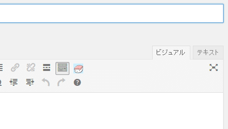
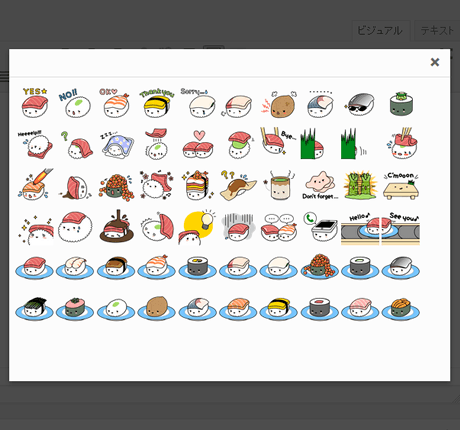

# TinyMCE Sushiyuki Plugin for WordPress

WordPress に標準搭載されているビジュアルエディタ （TinyMCE） に寿司ゆきアイコンを追加するプラグインです。
ゆるふわな雰囲気が特徴のお寿司のキャラクター「寿司ゆき」アイコンを記事内に追加できます。

[寿司ゆき (SUSHIYUKI) - ゆるふわお寿司のLINEスタンプ](http://awayuki.net/sushiyuki/)

## 使い方

インストール後、インストール済みプラグインの一覧ページから、「TinyMCE Sushiyuki Plugin」 を有効にするとすると寿司ゆきのボタンがビジュアルエディタに追加されます。

このボタンをクリックすると寿司ゆきアイコン一覧が表示されますので、使いたい寿司ゆきアイコンをクリックしてください。画像が挿入されます。

画像には i-sushiyuki という class 名がつきますので、必要に応じて CSS で調整してください。初期状態では 300px 四方のサイズ（お皿に乗ったお寿司は 200px 四方）で画像が挿入されます。

## インストール

wp-sushi-for-tinymce を、WordPress のプラグインディレクトリにアップロードしてください。

    $WP_HOME/
        wp-content/
            plugins/
                wp-sushi-for-tinymce/

## 寿司ゆきイラストについて

同梱している寿司ゆきのイラストはすべて awayuki さん作の『折り詰め寿司ゆき』を使用しています。

『折り詰め寿司ゆき』は[クリエイティブ・コモンズライセンス (CC BY-NC-ND 4.0)](http://creativecommons.org/licenses/by-nc-nd/4.0/deed.ja)で提供されています。

##その他

プラグインの動作確認は、v3.9.1 上でのみ行っております。本プラグインの動作に関するお問い合わせは、下記 Blog 記事のコメント欄、もしくは Blog に記載の連絡先までお送りください。

[「寿司ゆき」 プラグイン 「SushiForTinyMCE」 を WordPress にも対応させてみた ： WWW WATCH](http://hyper-text.org/archives/2014/06/wordpress_sushi_for_tinymce.shtml)